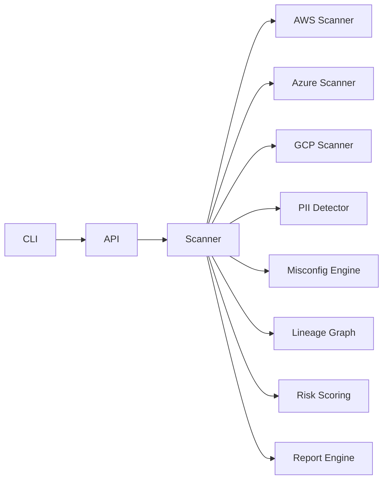

# Data Security Posture Management (DSPM) Engine

A production-grade, multi-cloud **Data Security Posture Management** engine that discovers cloud storage assets, detects Australian-centric sensitive data, highlights misconfigurations, builds lineage graphs, and generates audit-ready reports across AWS, Azure, and GCP.

## Table of Contents

- [Why DSPM?](#why-dspm)
- [Architecture](#architecture)
- [Core Capabilities](#core-capabilities)
- [Quickstart](#quickstart)
  - [Prerequisites](#prerequisites)
  - [Installation](#installation)
  - [Configuration](#configuration)
  - [Run a Scan](#run-a-scan)
  - [Generate Reports](#generate-reports)
  - [Run the API](#run-the-api)
- [Deployment](#deployment)
- [Reporting Outputs](#reporting-outputs)
- [Development Workflow](#development-workflow)
- [Repository Layout](#repository-layout)
- [Security & Compliance](#security--compliance)
- [License](#license)

## Why DSPM?

Data exposure often originates from unmanaged storage, shadow datasets, and weak configuration hygiene. This project demonstrates how to combine storage discovery, PII detection, lineage mapping, and automated reporting to align with APRA CPS 234 and the Australian Privacy Act. It is intended as an end-to-end reference for teams modernizing data security postures.

## Architecture



High-level flow:

1. **Discovery** enumerates storage assets per cloud provider.
2. **Sampling & Detection** run PII/keyword rules against sampled objects.
3. **Posture Analysis** evaluates encryption, public access, versioning, and IAM policies.
4. **Lineage** links related assets to show propagation paths.
5. **Risk Scoring** combines findings into a 0–100 posture score.
6. **Reporting** renders Markdown/JSON artefacts for auditors and engineers.

See `docs/ARCHITECTURE.md` for a detailed component breakdown and operational notes.

## Core Capabilities

- **Asset discovery** across AWS S3, Azure Blob Storage, and GCP Cloud Storage using provider abstractions.
- **Sensitive data detection** via regex-driven rules for AU PII (TFN, Medicare, ABN), financial identifiers, and email/phone patterns.
- **Misconfiguration checks** for public buckets, missing encryption, versioning gaps, permissive policies, lifecycle gaps, and backup immutability.
- **Data lineage** generation with NetworkX and Mermaid export to visualise data movement.
- **Risk scoring** that blends data findings with configuration posture.
- **Reporting** in Markdown or JSON via Jinja2 templates for stakeholders.
- **Automation-ready interfaces** through both CLI and FastAPI.

## Quickstart

### Prerequisites

- Python 3.11+
- Optional: Docker (for containerized API)

### Installation

```bash
pip install -r requirements.txt
```

### Configuration

- Enable or disable providers in `dspm_engine/config/providers.yaml`.
- Extend or tune PII detection rules in `dspm_engine/config/pii_rules.json`.
- Cloud SDK credentials are **not** bundled; wire in environment variables or profiles when replacing the sample discovery routines with SDK calls.

### Run a Scan

Scan all providers or a subset from the CLI:

```bash
python -m dspm_engine.cli.dspmctl scan aws azure gcp
python -m dspm_engine.cli.dspmctl scan aws
```

### Generate Reports

Produce Markdown or JSON outputs:

```bash
python -m dspm_engine.cli.dspmctl report --format markdown --output dspm_report.md
python -m dspm_engine.cli.dspmctl report --format json --output dspm_report.json
```

### Run the API

```bash
uvicorn dspm_engine.api.server:app --reload
```

Then visit `http://localhost:8000/docs` for the interactive OpenAPI UI. Example request:

```bash
curl -X POST http://localhost:8000/scan -H "Content-Type: application/json" \
  -d '{"providers": ["aws", "azure"]}'
```

## Deployment

- **Local**: run the CLI directly or start FastAPI with Uvicorn.
- **Docker**: `docker build -t dspm-engine .` then `docker run -p 8000:8000 dspm-engine`.
- **Docker Compose**: `docker-compose up` launches the API and dependencies defined in `docker-compose.yml`.

## Reporting Outputs

Rendered reports use templates under `dspm_engine/report/templates/` and include:

- Executive summary with overall risk score and highlights.
- Asset inventory and posture findings per provider.
- Sensitive data detection examples with locations.
- Misconfiguration details and remediation guidance.
- Data lineage diagram in Mermaid syntax for quick visualization.

## Development Workflow

- Format/lint: `ruff check` and `ruff format`.
- Tests: `pytest` (see `dspm_engine/tests/`).
- Containers: `docker-compose up` for API + worker simulation.
- CI: GitHub Actions workflow `.github/workflows/ci.yml` runs linting and tests on every push.

## Repository Layout

- `dspm_engine/core/`: scanning, detection, lineage, and risk logic.
- `dspm_engine/core/models.py`: shared dataclasses for assets and inventories.
- `dspm_engine/api/`: FastAPI service exposing scan endpoints.
- `dspm_engine/cli/`: CLI entrypoint `dspmctl`.
- `dspm_engine/report/`: reporting engine and templates.
- `dspm_engine/config/`: provider and PII rule configuration.
- `.github/workflows/`: CI definitions.
- `dspm_engine/tests/`: unit tests.
- `dspm_engine/examples/`: sample exported inventory.
- `docs/`: architecture, API, and contribution guidance.

## Security & Compliance

- Aligns with **APRA CPS 234** focus on control effectiveness and continuous monitoring.
- Supports **Australian Privacy Act** obligations for identifying and protecting personal information.
- See `SECURITY.md` for vulnerability reporting and hardening guidance, and review the threat model/patching recommendations therein.

## License

MIT License. See `LICENSE` for details.
