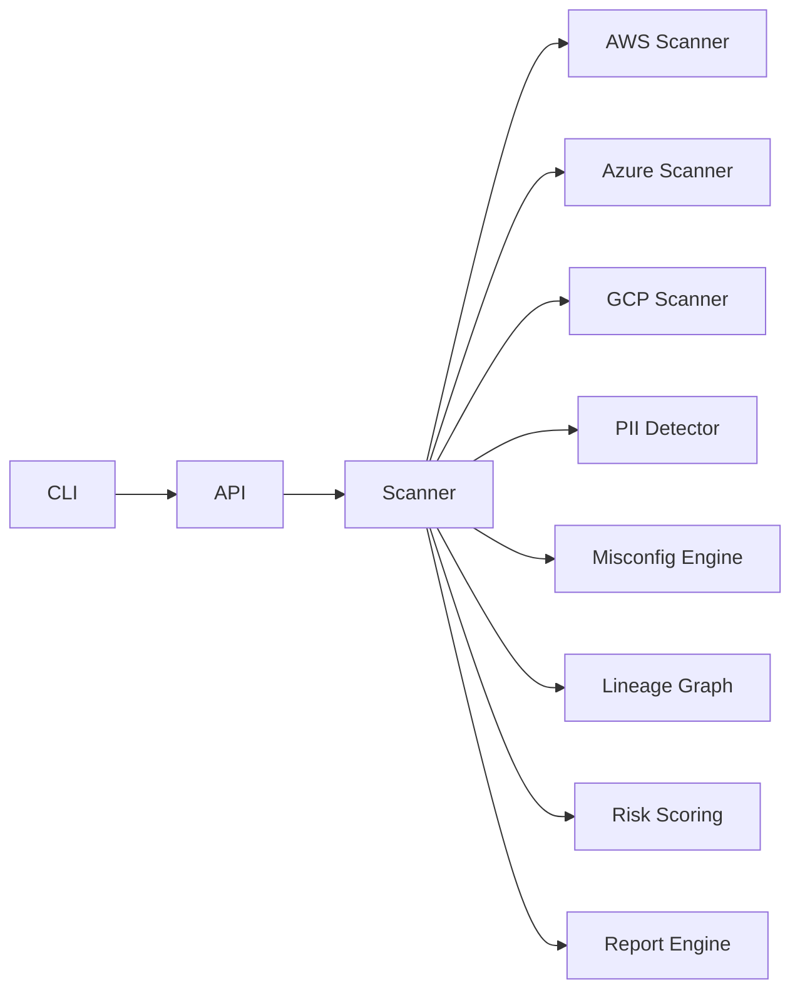

# Data Security Posture Management (DSPM) Engine

A production-grade, multi-cloud **Data Security Posture Management** engine that discovers cloud storage assets, detects Australian-centric sensitive data, highlights misconfigurations, builds lineage graphs, and generates audit-ready reports across AWS, Azure, and GCP.

## Why DSPM?

Data exposure often originates from unmanaged storage, shadow datasets, and weak configuration hygiene. This project demonstrates how to combine storage discovery, PII detection, lineage mapping, and automated reporting to align with APRA CPS 234 and the Australian Privacy Act.

## Architecture



## Features

- **Asset discovery** across AWS S3, Azure Blob Storage, and GCP Cloud Storage using provider abstractions
- **Sensitive data detection** via regex-driven rules for AU PII (TFN, Medicare, ABN) and financial patterns
- **Misconfiguration checks** for public buckets, missing encryption, versioning gaps, permissive policies, and backup immutability
- **Data lineage** generation with NetworkX and Mermaid export
- **Risk scoring** that combines data findings and configuration posture
- **Reporting** in Markdown or JSON via Jinja2 templates
- **CLI and FastAPI** interfaces for automation and integration

## Getting Started

### Prerequisites
- Python 3.11+
- Optional: Docker (for containerized API)

### Installation

```bash
pip install -r requirements.txt
```

### CLI Usage

```bash
python -m dspm_engine.cli.dspmctl scan aws azure gcp
python -m dspm_engine.cli.dspmctl report --format markdown --output dspm_report.md
```

### API Usage

```bash
uvicorn dspm_engine.api.server:app --reload
```

Then visit `http://localhost:8000/docs` for the interactive OpenAPI UI.

### Reports

Rendered reports use templates under `dspm_engine/report/templates/` and include:
- Executive-style summary with risk score
- Asset inventory and posture
- Sensitive data findings
- Misconfiguration details
- Data lineage diagram in Mermaid syntax

## Configuration

Provider toggles live in `dspm_engine/config/providers.yaml`. PII detection rules live in `dspm_engine/config/pii_rules.json` and can be extended with additional regex definitions.

## Security & Compliance

- Aligns with **APRA CPS 234** focus on control effectiveness and continuous monitoring.
- Supports **Australian Privacy Act** obligations for identifying and protecting personal information.
- See `SECURITY.md` for vulnerability reporting and hardening guidance.

## Development

- Format/lint: `ruff check` and `ruff format`
- Tests: `pytest`
- Containers: `docker-compose up` for API + worker simulation
- CI: GitHub Actions workflow `.github/workflows/ci.yml` runs lint and tests

## Repository Layout

- `dspm_engine/core/`: scanning, detection, lineage, and risk logic
- `dspm_engine/core/models.py`: shared dataclasses for assets and inventories
- `dspm_engine/api/`: FastAPI service exposing scan endpoints
- `dspm_engine/cli/`: CLI entrypoint `dspmctl`
- `dspm_engine/report/`: reporting engine and templates
- `dspm_engine/config/`: provider and PII rule configuration
- `.github/workflows/`: CI definitions
- `dspm_engine/tests/`: unit tests
- `dspm_engine/examples/`: sample exported inventory
- `docs/`: architecture and contribution guidance

## License

MIT License. See `LICENSE` for details.
